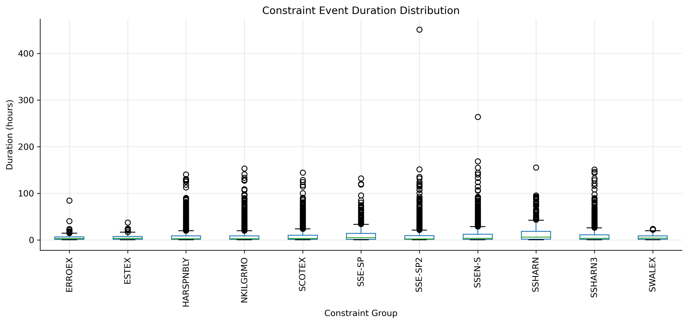
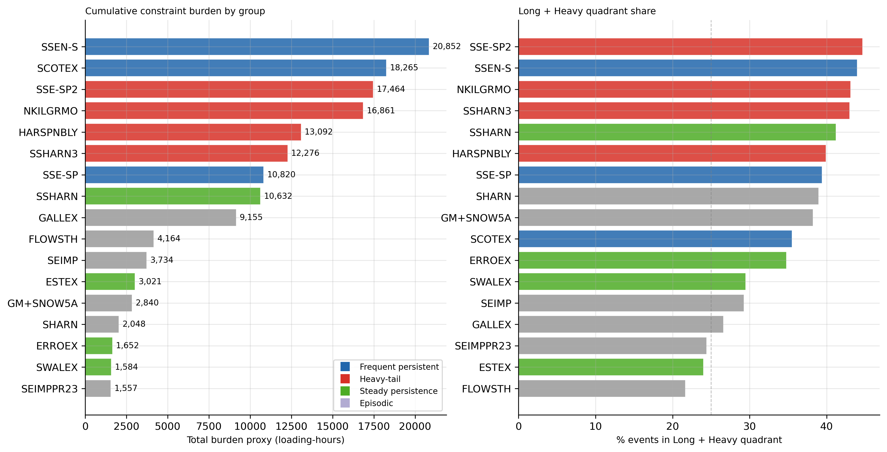
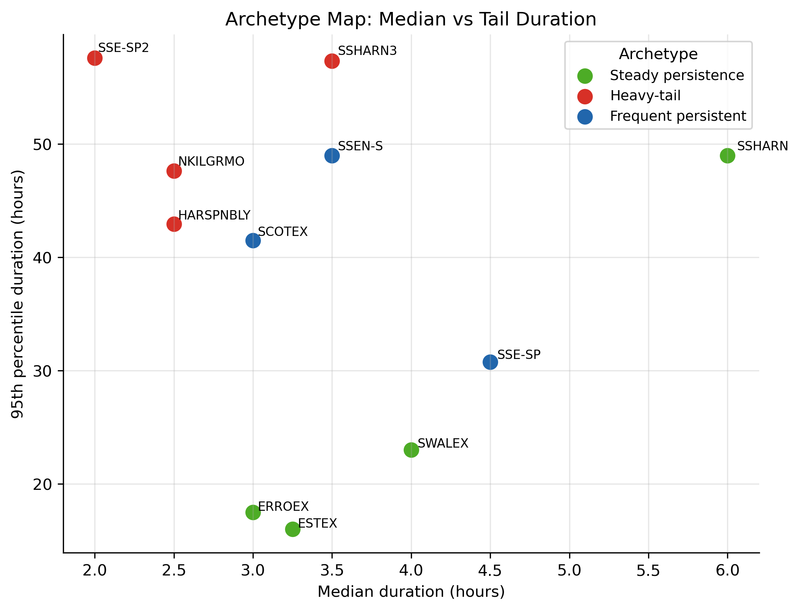
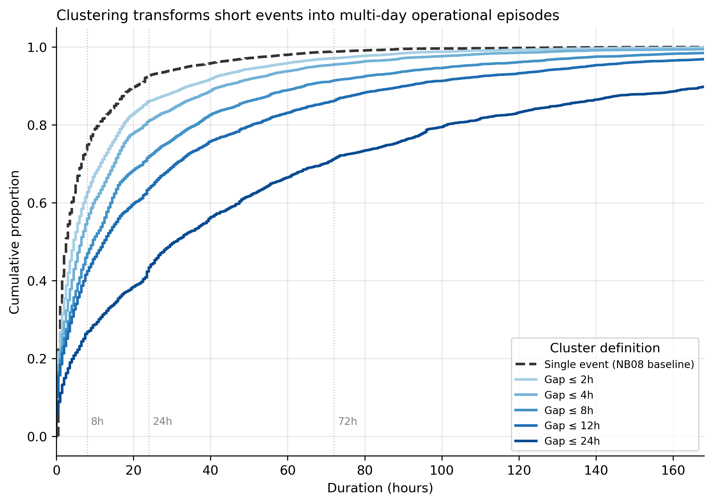
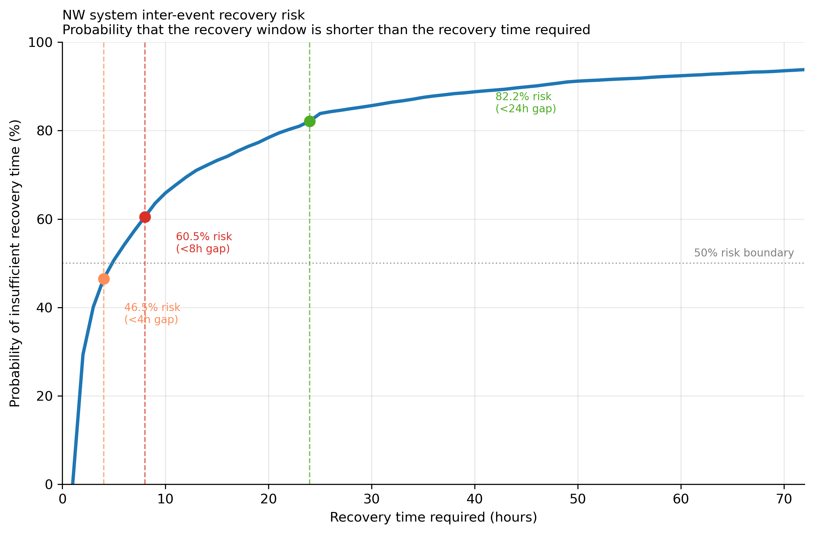
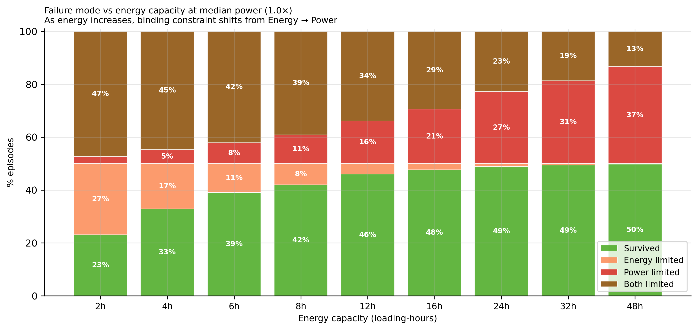
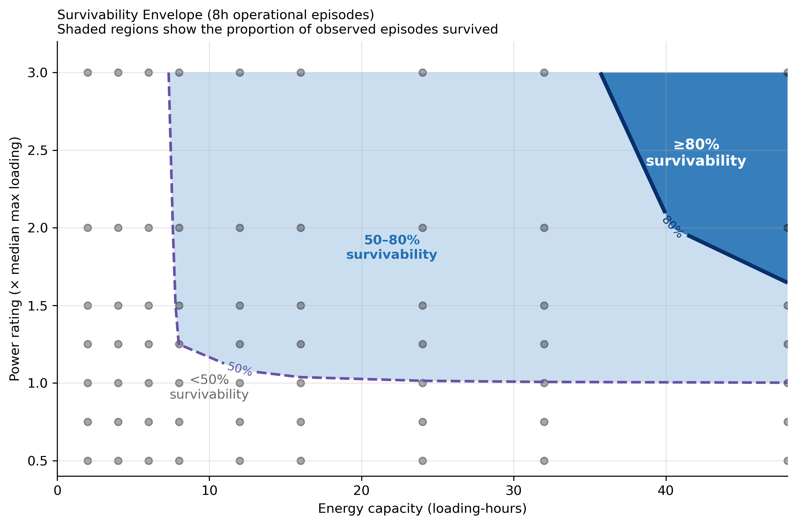
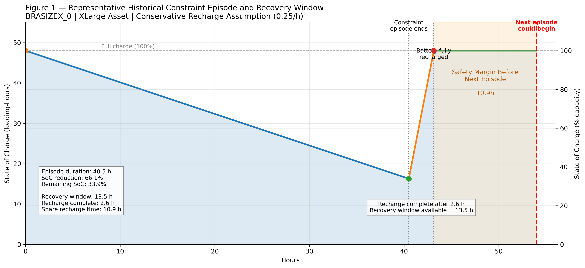
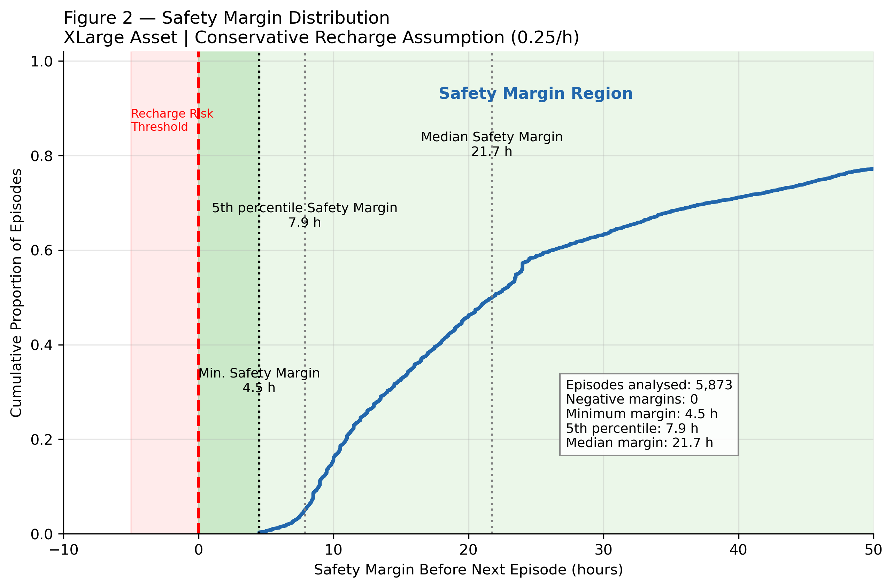
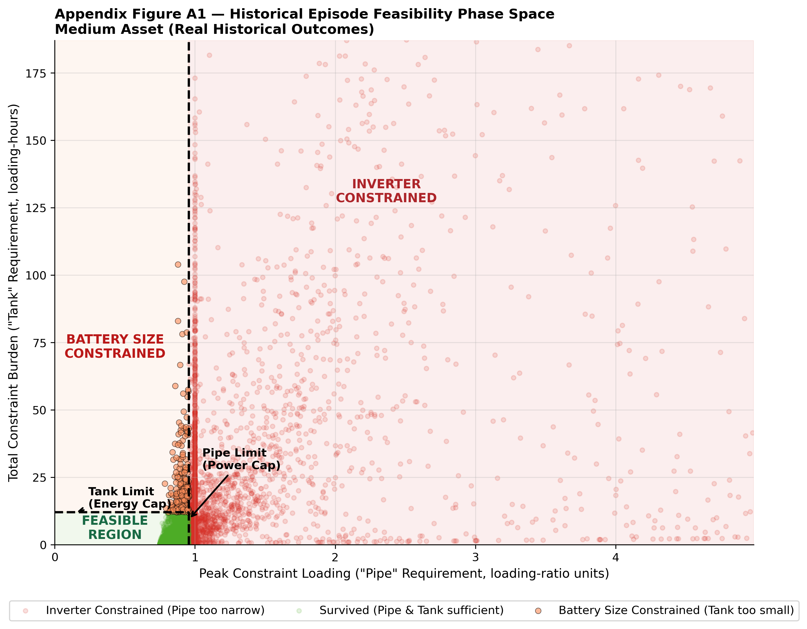

# GB Constraint Analytics Platform

## Constraint Behaviour and Storage Feasibility in the Great Britain Electricity System

### Project Findings Report (Version 1)

---

# Executive Summary

## Objective

This study investigates whether observed transmission constraint behaviour in the Great Britain electricity system creates a material operational challenge for Battery Energy Storage Systems (BESS).

The analysis combines transmission constraint data, Balancing Mechanism data and derived operational metrics to characterise:

1. Constraint persistence
2. Operational burden
3. Constraint clustering
4. Storage survivability
5. State-of-charge dynamics

The central research question is:

> Do clustered transmission constraint episodes create a material recharge limitation for representative storage assets?

---

## Principal Findings

Transmission constraint behaviour exhibits persistence, burden concentration and temporal clustering. Constraint events therefore cannot be treated as independent observations when assessing storage requirements.

Representative battery simulations show that asset performance is primarily determined by power capability and energy capacity during operational episodes. Smaller assets are predominantly power-constrained, while larger assets increasingly encounter energy limitations during prolonged episodes.

Despite meaningful clustering, historical recovery windows are generally sufficient for batteries to fully recharge between episodes. Across the observed dataset, recharge risk was not found to be a material operational limitation.

The dominant challenge for flexibility assets is therefore delivering sufficient power and energy during operational episodes rather than recovering between episodes.

---

## Key Conclusions

1. Constraint events exhibit meaningful persistence and clustering.
2. Operational burden is highly concentrated across a small number of locations and episodes.
3. Power capability acts as the primary design constraint for representative storage assets.
4. Energy capacity becomes relevant only after power requirements have been satisfied.
5. Recharge risk was not observed to be a binding operational limitation.
6. Significant operational burden remains uncaptured even for large representative assets.

---

# 1. Introduction

## Motivation

Transmission constraints are an increasingly important feature of the Great Britain electricity system.

Battery Energy Storage Systems (BESS) are frequently proposed as a solution to congestion management, renewable integration and system flexibility challenges. However, relatively little work has been undertaken to characterise the physical structure of transmission constraint behaviour before evaluating storage feasibility.

This study addresses that gap by examining how historical constraint events evolve through time and how representative storage assets perform under observed operating conditions.

---

## Research Questions

1. How persistent are transmission constraint events?

2. How severe are operational episodes?

3. Do constraint events occur independently or in clusters?

4. What power and energy capabilities are required to survive observed episodes?

5. Does recharge risk materially constrain asset performance?

---

# 2. Data and Methodology

## Data Sources

The analysis integrates:

* Transmission constraint datasets
* Balancing Mechanism data
* Market signal datasets
* Derived operational metrics

These datasets were assembled within the GB Constraint Analytics Platform.

---

## Key Metrics

### Loading Ratio

A dimensionless measure of operational loading relative to observed constraint conditions.

### Burden Proxy

A composite measure combining loading intensity and event duration.

### Operational Episode

A cluster of constraint events separated by less than a specified recovery-gap threshold.

### Survivability

An asset survives an operational episode when both:

* Power requirements remain within asset capability.
* Energy requirements remain within available capacity.

---

## Important Interpretation Note

Power and energy values throughout this study are expressed in relative loading-ratio units and loading-hours rather than absolute MW and MWh.

Results therefore describe comparative capability requirements and relative performance rather than specific storage specifications.

---

# 3. Constraint Behaviour

## Finding 1 — Constraint Events Exhibit Persistence

Historical constraint events cannot be characterised solely by average duration.

Most events are relatively short, but a persistent tail of longer-duration events creates recurring operational challenges.

### Implication

Constraint behaviour contains meaningful persistence and cannot be treated as a collection of isolated observations.

Constraints are not isolated events.

---

## Finding 2 — Operational Burden is Highly Concentrated

Operational burden is not evenly distributed across the network.

A relatively small number of boundaries account for a disproportionate share of total burden.

Most burden lives in a small number of locations.

### Implication

Constraint management challenges are concentrated rather than uniformly distributed.

---

## Finding 3 — Distinct Behavioural Archetypes Exist

Transmission boundaries exhibit markedly different combinations of persistence, burden and operational intensity.

### Implication

No single representative constraint profile adequately describes the observed system.

Not all boundaries behave the same way.

---

# 4. Sequence Behaviour

## Finding 4 — Constraint Events Cluster into Operational Episodes

Many apparently independent events combine into larger operational episodes when realistic recovery-gap thresholds are applied.

### Implication

Constraint behaviour exhibits meaningful temporal structure.

Operational episodes provide a more realistic unit of analysis than individual settlement periods.

Independent events become episodes.

---

## Finding 5 — Recovery Windows Remain Substantial

Recovery periods between operational episodes are typically long relative to battery recharge requirements.

Median recovery windows are approximately one day, with upper-quartile recovery periods substantially longer.

### Implication

Recharge opportunities remain available despite the presence of clustering.

Recovery windows exist.

---

# 5. Storage Feasibility

## Finding 6 — Power Capability is the Primary Design Constraint

Historical episode outcomes indicate that power capability acts as the first feasibility hurdle.

Many smaller assets fail power-feasibility tests before energy capacity becomes relevant.

### Implication

A battery may possess sufficient stored energy yet remain unable to participate because instantaneous discharge capability is inadequate.

Power capability therefore represents the primary design constraint at the studied transmission boundaries.

Static Failure
Dynamic Depletion
Survived

---

## Finding 7 — Energy Capacity Becomes the Secondary Constraint

Once power requirements are satisfied, energy limitations become increasingly important.

Larger assets experience dynamic depletion during prolonged episodes even when instantaneous power capability is sufficient.

### Implication

Power and energy act as separate operational constraints.

Energy capacity becomes relevant only after power requirements have been met.

What asset sizes actually work?

---

## Finding 8 — Failure Mechanisms are Physically Distinct

Two dominant failure mechanisms emerge:

### Static Failure

The asset lacks sufficient discharge capability to participate.

### Dynamic Depletion

The asset begins the episode successfully but exhausts available energy before the episode concludes.

### Implication

Understanding the distinction between power-limited and energy-limited behaviour is essential when designing storage assets for congestion management applications.

How recharge works.

---

# 6. State-of-Charge Dynamics

## Finding 9 — Recharge Risk is Not a Material Constraint

State-of-charge simulations indicate that representative assets begin virtually all historical episodes fully charged.

Historical recovery windows consistently exceed recharge requirements.

### Implication

Recharge limitations do not materially affect survivability under observed conditions.

Recharge works historically.

---

## Finding 10 — Safety Margins Remain Positive

Historical safety-margin analysis demonstrates that observed recovery windows exceed required recharge durations across the analysed episode population.

No historical episode entered the recharge-risk region.

### Implication

Recharge risk does not appear to be a binding operational limitation under observed operating conditions.

---

# 7. Discussion

## Initial Hypothesis

The motivating hypothesis was:

Constraint Clustering
→ Recharge Pressure
→ Battery Limitation

---

## Observed Behaviour

The observed behaviour is:

Constraint Clustering
→ Recovery Pressure Exists
→ Recovery Windows Remain Sufficient
→ Power and Energy Requirements Dominate Outcomes

---

## Interpretation

The analysis demonstrates that transmission constraints create meaningful operational challenges for storage assets.

However, those challenges arise primarily from the power and energy requirements of individual operational episodes rather than from recharge limitations between episodes.

The evidence therefore does not support the hypothesis that recharge risk is a primary operational constraint under historical operating conditions.

---

# 8. Limitations

## Relative Asset Sizing

Results are expressed in loading-ratio units and loading-hours rather than absolute MW and MWh.

---

## Simplified Intra-Episode Dynamics

State-of-charge modelling assumes simplified discharge behaviour within operational episodes.

---

## Historical Scope

Results describe historical operating conditions and should not be interpreted as forecasts. Future system changes (higher renewable penetration, EV demand, grid outages) could alter recharge opportunity distribution

---

## Regional Scope

Results reflect the analysed transmission boundaries and may not generalise to all regions or future network configurations.

---

## Economic Value

Market value, revenue capture and flexibility economics are intentionally outside the scope of this phase of the project.

---

# 9. Conclusions

## Principal Conclusions

1. Constraint events exhibit persistence, burden accumulation and clustering.

2. Operational burden is highly concentrated across a relatively small number of locations and episodes.

3. Power capability represents the primary design constraint for representative storage assets.

4. Energy capacity becomes important only after power requirements have been satisfied.

5. Recharge risk was not observed as a binding operational limitation.

6. Constraint episodes behave as effectively independent challenges from a state-of-charge perspective.

7. Delivering sufficient power and energy during operational episodes is a more significant challenge than recovering between episodes.

---

# 10. Future Work

## Part III — Constraint Economics and Flexibility Value

This study establishes the physical operating characteristics of observed transmission constraint episodes.

Future work will investigate:

* Market conditions during operational episodes
* Constraint pricing dynamics
* Flexibility value
* Revenue capture
* Asset opportunity
* Economic significance of constraint behaviour

The engineering analysis presented here provides the physical foundation for that future economic assessment.

# Appendix

## Appendix Figure A1

Why power matters before energy.